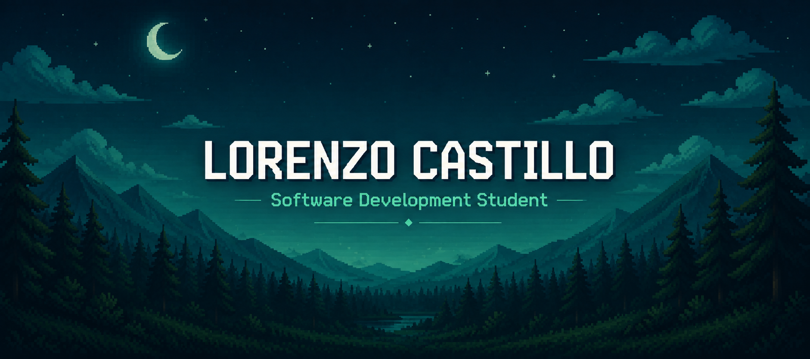

<h1>¡Hola! Soy Lorenzo </h1>

> Estudiante de Desarrollo de Software, enfocado en construir bases sólidas en backend y bases de datos. Trabajo con **C#** y **SQL Server**, con experiencia práctica en desarrollo web, y actualmente ampliando mi stack hacia **Python** y **Firebase**. Me gusta aprender haciendo y entender a fondo cómo funcionan las cosas antes de implementarlas.

---

### 🛠️ Tech & Tools

